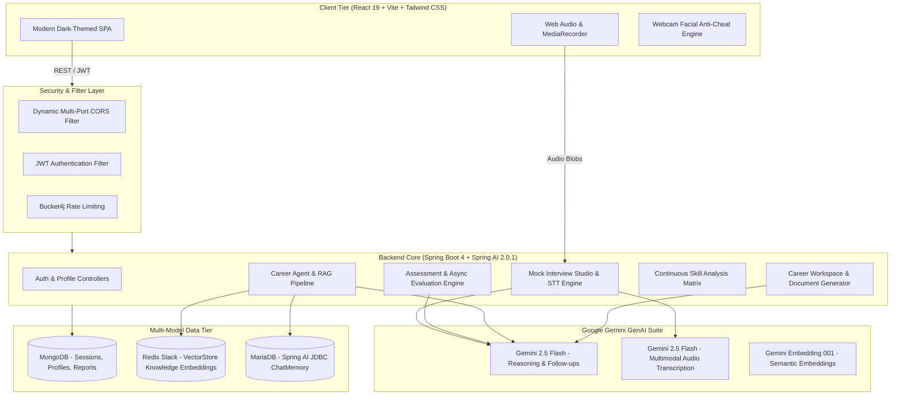
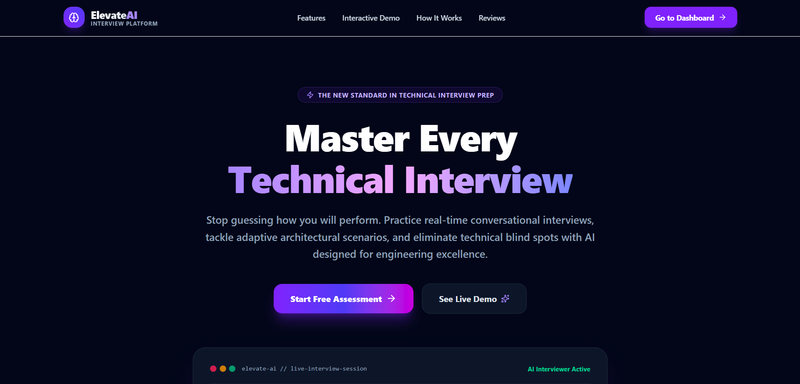
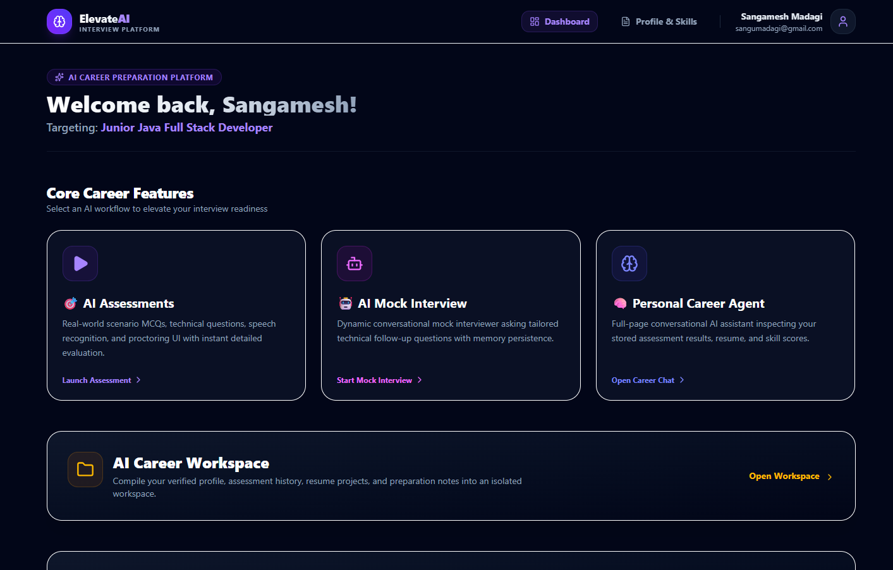
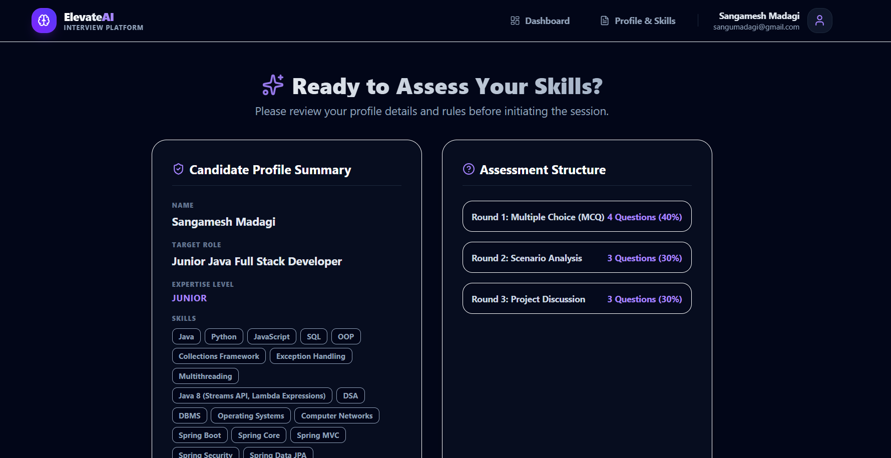
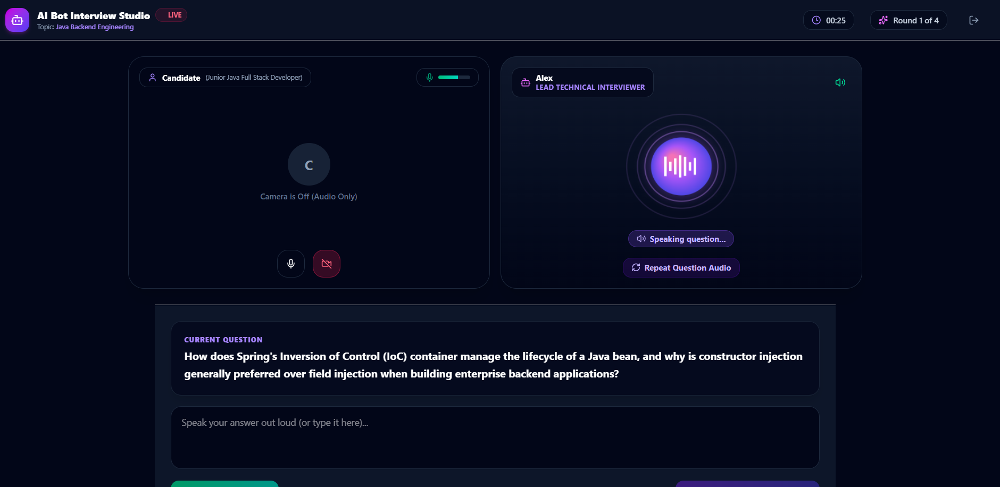
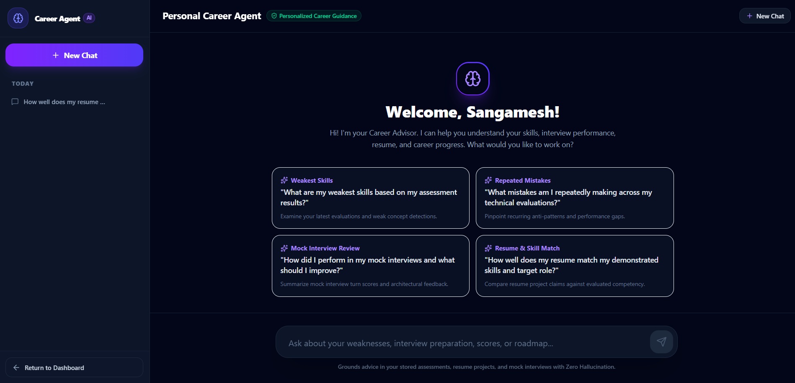
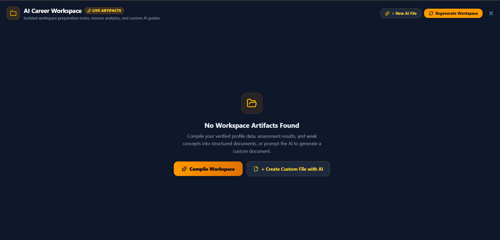
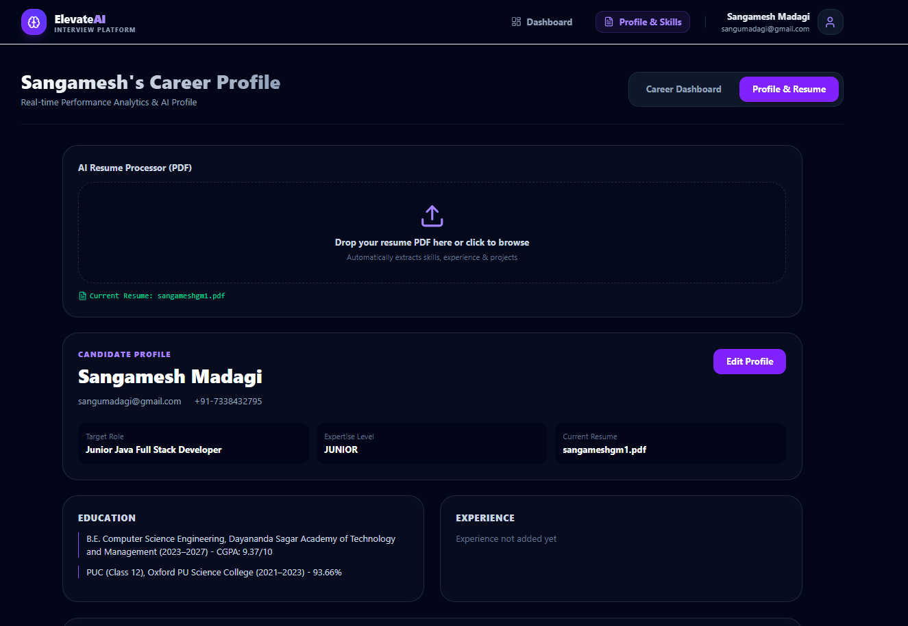
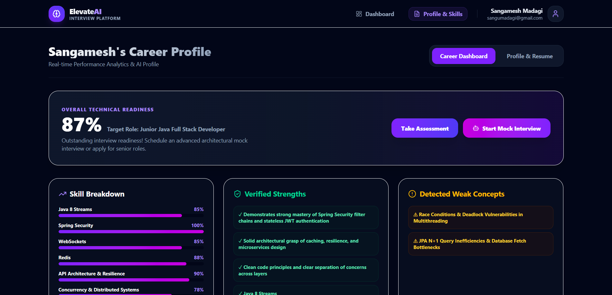

# AI Interview & Career Preparation Platform

<div align="center">


**An enterprise-grade, end-to-end AI career acceleration ecosystem featuring adaptive technical assessments, real-time voice bot mock interviews with dual STT, autonomous career agents with RAG & tool-calling, and continuous skill analytics.**

</div>

---

## 📑 Table of Contents
- [Architecture Overview](#-architecture-overview)
- [The 4 Core Pillars](#-the-4-core-pillars)
- [Application Screenshots & UI Showcase](#-application-screenshots--ui-showcase)
- [Technology Stack](#-technology-stack)
- [Getting Started](#-getting-started)
  - [1. Prerequisites](#1-prerequisites)
  - [2. Environment Setup](#2-environment-setup)
  - [3. Infrastructure (Docker Compose)](#3-infrastructure-docker-compose)
  - [4. Run Backend](#4-run-backend)
  - [5. Run Frontend](#5-run-frontend)
- [API Reference](#-api-reference)
- [Testing & Quality Assurance](#-testing--quality-assurance)

---

## 🏛 Architecture Overview



---

## 🚀 The 4 Core Pillars

### 1. 🎯 AI Adaptive Assessments
* **3-Stage Technical Evaluation**:
  1. **Foundational MCQs**: Timed, multi-choice technical questions with instant validation.
  2. **Architectural Scenarios**: Scenario-based questions requiring deep trade-off evaluation.
  3. **Resume Project Deep Dives**: Questions tailored directly to projects extracted from the candidate's parsed resume.
* **Smart Audio-Input**: Candidates can dictate code explanations or answers using browser voice recording.
* **Proctoring & Anti-Cheat Suite**:
  * Face detection & periodic identity verification via TensorFlow.js models.
  * Browser tab-switching, focus-loss, and multi-display monitoring with violation logging.
* **Asynchronous Deep Evaluation**: Asynchronous evaluation pipeline generating comprehensive scorecards with strengths, weaknesses, concepts to study, and code improvements.

### 2. 🤖 Real-Time AI Mock Interview Studio
* **Interactive Bot Interviewer**: AI speaks questions using browser Text-to-Speech (TTS) and dynamically listens to spoken answers.
* **Dual Speech-to-Text (STT) Architecture**:
  * **Primary**: High-speed native browser Web Speech API.
  * **Fallback**: Server-side **Google Gemini 2.5 Flash Multimodal STT** (`/api/interview/transcribe`), ensuring zero failure in privacy-shielded browsers (e.g. Brave, Firefox).
* **Objective Logical Scoring (0–100%)**:
  * Identifies unattempted questions or admissions of not knowing (`"I don't know"`, `"skip"`, filler greetings) via `isNonAnswer` filtering and scores them honestly as `0.0%`.
  * Single-call optimization generating turn score, constructive interviewer feedback, and targeted follow-up questions simultaneously.
* **Mid-Session Safe Exit**: Candidates can gracefully exit interviews (`/api/interview/{sessionId}/exit`), updating Career Profile status to `Exited in between` with `Incomplete` score badges.

### 3. 🧠 Autonomous Personal Career Agent
* **Spring AI Tool Calling (`@Tool`)**: The agent dynamically calls backend tools to inspect candidate scores, query resume projects, read assessment results, and calculate skill gaps.
* **Tenant-Isolated RAG (Retrieval-Augmented Generation)**: Uses **Redis Stack VectorStore** with strict user-level metadata filters (`userId`, `documentType`, `topic`) to prevent cross-candidate data leakage.
* **Persistent Multi-Turn Chat Memory**: Leverages Spring AI `JdbcChatMemoryRepository` on MariaDB to maintain conversational context across sessions.
* **Conversation Renaming & Management**: Inline chat title renaming with persistence in `career_conversation_meta`, localStorage cache fallback, and chat history deletion.

### 4. 📁 AI Career Workspace & Skill Dashboard
* **On-Demand Custom AI File Generator**: Prompt the AI to generate any custom Markdown document (e.g. `Kafka-CheatSheet.md`, `Cover-Letter.md`, `System-Design.md`) with one-click inspiration templates.
* **Comprehensive 7-Document Default Suite**:
  * `Resume/Resume-Analysis.md` — Concrete executive summary & architectural claims (without placeholders).
  * `Resume/ATS-Optimization-Checklist.md` — Target keyword density, Google XYZ impact formula rewrites, and pre-submission checklist.
  * `Interview/Weak-Topics.md` — Targeted weak concept mastery & gap remediation plan.
  * `Interview/Resume-Questions.md` — Project-specific cross-examination questions tailored to candidate projects.
  * `Interview/System-Design-CheatSheet.md` — High-yield architecture playbook (Redis caching, Kafka decoupling, DB composite indexing, Resilience4j).
  * `Preparation/30-Day-Roadmap.md` — 4-week structured preparation calendar from core fundamentals to mock drills.
  * `Progress/Skill-Progress.md` — Verified competency metrics and readiness index tracker.
* **Workspace Management**: Individual file deletion with path-traversal protection and one-click workspace clear/reset.
* **Continuous Skill Analysis Matrix**: Aggregates all completed assessments and interviews into real-time job readiness scores, core competency percentages, and prioritized learning paths.

---

## 📸 Application Screenshots & UI Showcase

### 🌟 Platform Overview
| Landing Page | Candidate Home Dashboard |
| :---: | :---: |
|  <br><sub>`screenshots/landing.png`</sub> |  <br><sub>`screenshots/home.png`</sub> |

### 🎯 4 Core AI Features
| 1. AI Adaptive Assessments | 2. Real-Time Bot Mock Interview Studio |
| :---: | :---: |
|  <br><sub>`screenshots/ai-assessments.png`</sub> |  <br><sub>`screenshots/mock-interview.png`</sub> |
| **3. Autonomous Personal Career Agent** | **4. AI Career Workspace** |
|  <br><sub>`screenshots/career-agent.png`</sub> |  <br><sub>`screenshots/career-workspace.png`</sub> |

### 👤 Profile & Analytics
| Candidate Profile & Resume Parsing | Career Analytics & Job Readiness Scorecard |
| :---: | :---: |
|  <br><sub>`screenshots/profile.png`</sub> |  <br><sub>`screenshots/career-dashboard.png`</sub> |

---

## 🛠 Technology Stack

### Backend
| Component | Technology | Description |
|---|---|---|
| **Framework** | Spring Boot 4.0.0 | Core backend microservice framework |
| **AI Integration** | Spring AI 2.0.1 | ChatClient, Advisors, Tool Calling, VectorStore |
| **LLM & Embeddings**| Google Gemini 2.5 Flash | `gemini-3.6-flash`, `gemini-embedding-001` |
| **Document DB** | MongoDB | Primary store for users, profiles, assessments, tests |
| **Vector Store** | Redis Stack 7.4 | Semantic search, vector embeddings, tenant isolation |
| **Relational DB** | MariaDB | Spring AI JDBC ChatMemory persistence |
| **Security** | Spring Security & JWT | Stateless token-based authentication & multi-port CORS |
| **Email** | Spring Mail (Gmail SMTP) | OTP verification and password recovery |

### Frontend
| Component | Technology | Description |
|---|---|---|
| **Core** | React 19 + Vite 8 | High-performance modern client SPA |
| **Styling** | Tailwind CSS 3.4 | Polished dark-mode engineering UI |
| **Icons & Animations** | Lucide React + Framer Motion | Smooth interactions & micro-animations |
| **Charts** | Recharts | Interactive radar & bar charts for skill breakdown |
| **HTTP Client** | Axios | Interceptors for JWT auth & resilient retries |

---

## 🏁 Getting Started

### 1. Prerequisites
- **Java 17 or higher** (Java 21 / 23 supported)
- **Maven 3.9+**
- **Node.js 18+** & **npm 9+**
- **Docker & Docker Compose**
- **Google Gemini API Key** (Free tier from [Google AI Studio](https://aistudio.google.com/))

### 2. Environment Setup
Copy the sample environment file to `.env`:
```bash
cp .env.example .env
```

Configure your environment variables in `.env`:
```env
# Google Gemini API
GEMINI_API_KEY=your_gemini_api_key_here
GEMINI_MODEL=gemini-3.6-flash

# Security & JWT
JWT_SECRET=your_jwt_secret_key_minimum_32_characters_here

# Database Infrastructure (matches docker-compose defaults)
MONGODB_URI=mongodb://localhost:27017/ai-interview
SPRING_DATASOURCE_URL=jdbc:mariadb://localhost:3307/aiinterview_ai
SPRING_DATASOURCE_USERNAME=aiuser
SPRING_DATASOURCE_PASSWORD=aipassword

# Redis Stack
REDIS_HOST=localhost
REDIS_PORT=6379

# Email Service (Optional for OTP verification)
MAIL_USERNAME=your_email@gmail.com
MAIL_PASSWORD=your_google_app_password
```

### 3. Infrastructure (Docker Compose)
Start MongoDB, Redis Stack, and MariaDB:
```bash
docker compose up -d
```

### 4. Run Backend
```bash
cd backend
mvn spring-boot:run
```
*Backend runs on:* `http://localhost:8080`

### 5. Run Frontend
```bash
cd frontend
npm install
npm run dev
```
*Frontend runs on:* `http://localhost:5173` *(and automatically supports `http://localhost:5174` via dynamic CORS)*

---

## 📡 API Reference

### Authentication (`/api/auth/**`)
| Method | Endpoint | Description |
|---|---|---|
| `POST` | `/api/auth/signup` | Register new user & send OTP |
| `POST` | `/api/auth/verify-otp` | Verify OTP code and activate account |
| `POST` | `/api/auth/login` | Authenticate user & issue JWT token |
| `GET` | `/api/auth/me` | Fetch currently authenticated user profile |
| `POST` | `/api/auth/forgot-password` | Request password reset OTP |
| `POST` | `/api/auth/reset-password` | Complete password reset |

### Candidate Profile & Resume (`/api/profile/**`)
| Method | Endpoint | Description |
|---|---|---|
| `GET` | `/api/profile/me` | Retrieve candidate profile & parsed resume |
| `POST` | `/api/profile/create` | Save candidate profile details |
| `POST` | `/api/profile/upload-resume` | Extract structured profile from PDF resume |

### AI Assessments (`/api/test/**`)
| Method | Endpoint | Description |
|---|---|---|
| `POST` | `/api/test/start` | Initialize adaptive 3-round assessment |
| `GET` | `/api/test/{testId}` | Retrieve active test session & questions |
| `POST` | `/api/test/{testId}/save-answer` | Auto-save draft question responses |
| `POST` | `/api/test/{testId}/submit-violation` | Record proctoring flag (tab switch, face loss) |
| `POST` | `/api/test/{testId}/identity/enroll` | Enroll candidate face embedding descriptor |
| `POST` | `/api/test/{testId}/identity/check` | Verify candidate face match during test |
| `POST` | `/api/test/{testId}/submit` | Submit test for async AI scoring |
| `GET` | `/api/test/{testId}/evaluation-status` | Poll asynchronous AI evaluation progress |
| `GET` | `/api/test/{testId}/result` | Fetch detailed score report & breakdown |
| `GET` | `/api/test/my-tests` | Retrieve candidate assessment history |

### Real-Time Bot Mock Interview (`/api/interview/**`)
| Method | Endpoint | Description |
|---|---|---|
| `POST` | `/api/interview/start` | Initialize 4-round technical mock interview |
| `POST` | `/api/interview/{sessionId}/answer` | Submit turn answer & receive AI evaluation + follow-up |
| `POST` | `/api/interview/transcribe` | Transcribe voice audio via Gemini 2.5 Flash STT |
| `POST` | `/api/interview/{sessionId}/exit` | Terminate session early & record exit status |
| `GET` | `/api/interview/{sessionId}` | Retrieve full transcript & turn history |
| `GET` | `/api/interview/my-interviews` | List candidate mock interview sessions |

### Career Agent & RAG (`/api/agent/**`)
| Method | Endpoint | Description |
|---|---|---|
| `POST` | `/api/agent/chat` | Conversational query with Spring AI tool calling & RAG |
| `GET` | `/api/agent/conversations` | Retrieve candidate chat conversation summaries |
| `GET` | `/api/agent/conversations/{id}` | Fetch full message transcript for conversation |
| `PATCH`| `/api/agent/conversations/{id}/rename` | Rename conversation history chat title |
| `DELETE`| `/api/agent/conversations/{id}` | Delete conversation and memory |

### Career Workspace (`/api/workspace/**`)
| Method | Endpoint | Description |
|---|---|---|
| `POST` | `/api/workspace/generate` | Compile default 7-document career workspace suite |
| `POST` | `/api/workspace/custom-file` | Generate custom AI Markdown file from user prompt |
| `GET` | `/api/workspace/files` | List user-scoped workspace directory tree |
| `GET` | `/api/workspace/file?path=...` | Read artifact file contents |
| `DELETE`| `/api/workspace/file?path=...` | Delete individual workspace file |
| `DELETE`| `/api/workspace/clear` | Clear all files in user workspace |

### Skill Matrix & Performance Analytics (`/api/skills/**`)
| Method | Endpoint | Description |
|---|---|---|
| `GET` | `/api/skills/me` | Fetch real-time job readiness & skill percentages |
| `POST` | `/api/skills/reanalyze` | Recalculate skill matrix from all activities |

---

## 🧪 Testing & Quality Assurance

### Run Backend Unit & Integration Tests
```bash
cd backend
mvn clean compile
mvn test
```
*Includes comprehensive verification suites for:*
- `AssessmentAsyncSubmissionAndStatusTest` — Async evaluation & status polling
- `MockInterviewFlowAndCareerDashboardTest` — Mock interview turn flow & exit state
- `CareerAgentIsolationAndMemoryTest` — Tenant isolation & JDBC ChatMemory
- `AudioTranscriptionUnitTest` — Multimodal audio transcription reliability
- `CareerWorkspaceSecurityTest` — Directory traversal prevention & isolation

### Run Frontend Production Build
```bash
cd frontend
npm run build
```